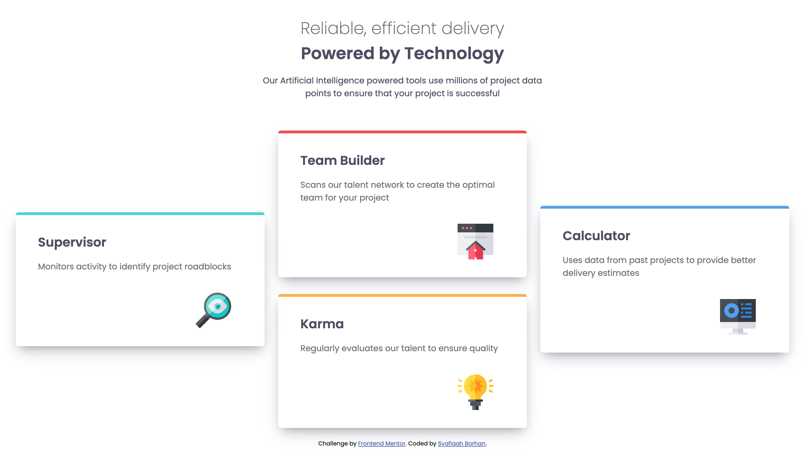

# Frontend Mentor - Four card feature section solution

This is a solution to the [Four card feature section challenge on Frontend Mentor](https://www.frontendmentor.io/challenges/four-card-feature-section-weK1eFYK). Frontend Mentor challenges help you improve your coding skills by building realistic projects.

## Table of contents

- [Overview](#overview)
  - [The challenge](#the-challenge)
  - [Screenshot](#screenshot)
  - [Links](#links)
- [My process](#my-process)
  - [Built with](#built-with)
  - [What I learned](#what-i-learned)
  - [Useful resources](#useful-resources)
- [Author](#author)

**Note: Delete this note and update the table of contents based on what sections you keep.**

## Overview

### The challenge

Users should be able to:

- View the optimal layout for the site depending on their device's screen size

### Screenshot



### Links

- Solution URL: [https://github.com/cosylily/four-card-feature.git]
- Live Site URL: [https://dancing-kelpie-be4166.netlify.app/]

## My process

### Built with

- HTML
- CSS

### What I learned

This time, I properly learned on YouTube how to use display flex rather than just guessing it and bulldozing it. Plus, I never knew that I can adjust the position of an item when using display grid. It does not look special when I copied paste the code, but the journey of finding out about it is certainly fun.

```css
.proud-of-this-css {
  display: grid;
  grid-template-columns: 1fr 1fr 1fr;
}
```

### Useful resources

- [https://www.youtube.com/watch?v=phWxA89Dy94] - Good explanation of how to use flex and the "feature" that came with display flex.
- [https://getcssscan.com/css-box-shadow-examples] - I have yet to understand how box-shadow work so I like to use this website to find similar box-shadow

## Author

- Website - [https://syafiqahborhan.netlify.app/]
- Frontend Mentor - [@cosylily](https://www.frontendmentor.io/profile/cosylily)
